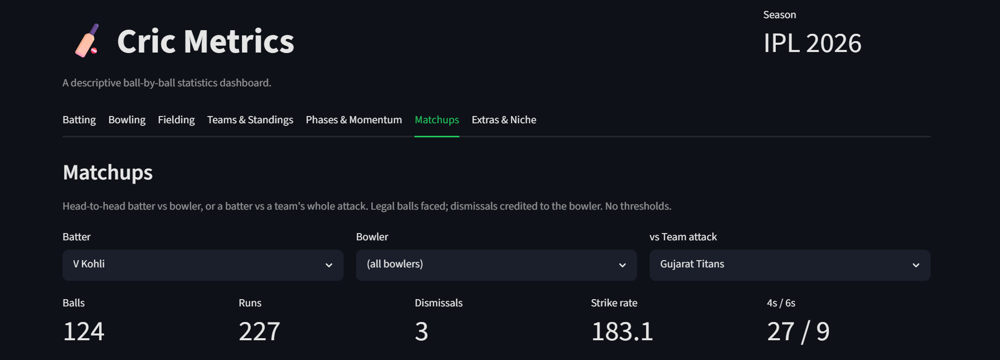

# 🏏 Cric Metrics

A descriptive, ball-by-ball statistics dashboard for **IPL 2026**, built from Cricsheet data with Python, pandas, Plotly, and Streamlit.

<!--
  Before publishing, replace the placeholders marked below:
  • Live demo URL  (after deploying to Streamlit Community Cloud)
  • docs/screenshot.png  (add a screenshot or short GIF of the app)
  • the clone URL, if your repo name differs from cric-metrics
  • your author links at the bottom
-->

[](https://www.python.org/)
[](https://streamlit.io/)
[-success)](https://cricsheet.org/)

**▶ Live demo:** _coming soon_ <!-- https://your-app.streamlit.app -->


<!-- Add a screenshot or short GIF at docs/screenshot.png and it will render here -->

---

## Overview

Cric Metrics turns a full season of IPL 2026 ball-by-ball data into an interactive, seven-tab analytics dashboard. Every metric is computed from the raw deliveries — there are no pre-aggregated feeds — and the focus is on **descriptive accuracy**: stats follow the same rules the official scorers and the ICC use, including the awkward edge cases (all-out net run rate, super-overs, rain-reduced innings, phase splits) that most hobby dashboards get subtly wrong.

The guiding principle across every tab: **every player is shown, with no qualification thresholds, and each rate sits next to its volume column** so you can judge sample size for yourself.

## Features

Seven tabs, most filterable by team, match phase (Powerplay / Middle / Death), and a "top N" control:

- **Batting** — top run-scorers, strike-rate vs balls-faced, boundary breakdown, a full season table, and batting-by-position splits.
- **Bowling** — top wicket-takers, economy vs overs bowled, and a full season table with averages, strike rates, dot %, and best figures.
- **Fielding** — dismissals by type (catches, caught-and-bowled, stumpings, run-outs) per fielder.
- **Teams & Standings** — the full points table with ICC-compliant Net Run Rate, validated against the official IPL 2026 final table.
- **Phases & Momentum** — per-match Manhattan (runs per over) and worm (cumulative runs) charts.
- **Matchups** — head-to-head batter vs bowler, or a batter against a team's whole attack.
- **Extras & Niche** — typed extras, DRS reviews, impact-player usage, and Player-of-the-Match.

## Data accuracy & methodology

The hard part of a cricket stats engine is the edge cases. Cric Metrics handles them explicitly:

- **Net Run Rate (ICC rules).** A team that is bowled out is charged its **full allotted quota of overs**, with that quota **read from each match's actual scheduled/revised overs** — never hardcoded to 20 — so rain-reduced and D/L-affected matches use the correct figure. Super-over innings and no-result matches are excluded from NRR. The computed standings match the official IPL 2026 final table to three decimal places.
- **Super-over results.** Matches tied after the main innings and decided by a super over are resolved from the match's `eliminator` field, so the super-over winner correctly receives the win and two points rather than being recorded as a one-point tie.
- **Phase-correct rates.** When a phase filter is applied, every rate uses phase-scoped numerators *and* denominators — a Powerplay batting average is phase runs ÷ phase dismissals, a phase economy is phase runs ÷ phase overs — and returns `None` instead of dividing by zero on empty samples.
- **Correct dismissal attribution.** Bowler wickets exclude run-outs and other non-bowler dismissals; fielders are credited with the run-outs they effect.
- **Typed extras.** Wides and no-balls are charged to the bowler; byes and leg-byes are not.

## Tech stack

- **Python** with **pandas** for parsing and aggregation
- **Streamlit** for the UI (dark theme, `plotly_dark` charts)
- **Plotly** for the interactive charts
- **Cricsheet** ball-by-ball JSON as the data source

Exact pinned versions are in [`requirements.txt`](requirements.txt).

## Project structure

```
cric-metrics/
├── app.py              # Streamlit UI — renders all seven tabs
├── analytics.py        # Stat computations (batting, bowling, fielding, standings/NRR, …)
├── parse.py            # Cricsheet JSON → two-table CSV (matches + deliveries)
├── data/               # Parsed CSVs (committed; loaded via @st.cache_data)
├── .streamlit/
│   └── config.toml     # Dark theme + green accent
├── requirements.txt
└── README.md
```

The raw Cricsheet match JSON (the full 74-match IPL 2026 season) is parsed once by `parse.py` into two cached CSVs — a match-level table and a ball-by-ball deliveries table. The app reads only those CSVs, so it never re-parses JSON at runtime.

## Running locally

Requires Python 3.11+ (developed on 3.13).

```bash
# 1. Clone
git clone https://github.com/alokday007/cric-metrics.git
cd cric-metrics

# 2. Create and activate a virtual environment
python -m venv venv
# Windows (PowerShell):
.\venv\Scripts\Activate.ps1
# macOS / Linux:
source venv/bin/activate

# 3. Install dependencies
pip install -r requirements.txt

# 4. (Optional) Regenerate the CSVs from the raw Cricsheet JSON
python parse.py

# 5. Run
streamlit run app.py
```

The app opens at `http://localhost:8501`.

## Deployment

The app is deployed on **Streamlit Community Cloud**. Because it loads the parsed CSVs via `@st.cache_data`, those CSVs are committed to the repository so the deployed app runs without access to the raw JSON. To deploy your own copy, push the repo to GitHub and point Streamlit Community Cloud at `app.py`.

## Data attribution & licence

Match data is sourced from **[Cricsheet](https://cricsheet.org/)**, licensed under the **Open Data Commons Attribution License (ODC-BY)**.

Cric Metrics is an independent, non-commercial statistics project. It is **not affiliated with, endorsed by, or associated with the BCCI, the IPL, or any franchise.** All team names and trademarks belong to their respective owners.

The project code is released under the MIT Licence — add a `LICENSE` file if you'd like to make that explicit.

## Author

Built by **Alok** as a portfolio project.
<!-- Add your links, e.g. GitHub · LinkedIn · portfolio -->
